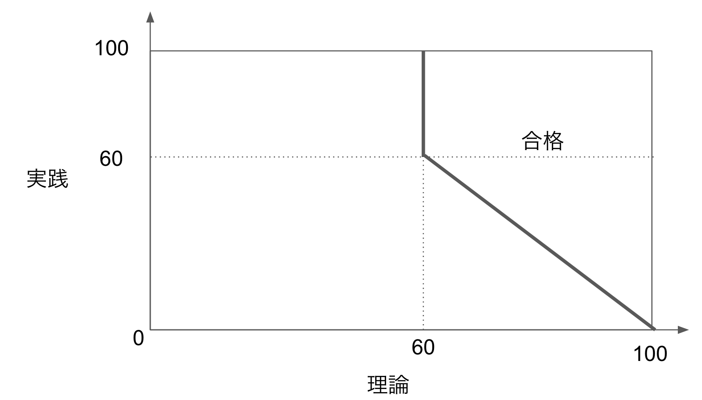
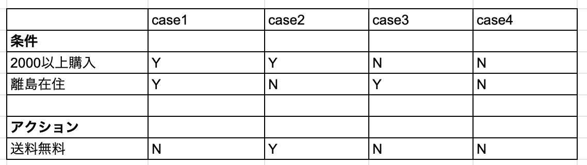

# 05.変数が複数ある場合のテスト：ドメイン分析テストとデジジョンテーブル

これまでは数値のみのシンプル条件分岐を例で見てきましたが、実際にはより複雑な処理のテストを行うことがあります。

この場合、複雑な処理は「複数の種類、複数の変数を考慮する条件分岐」を意味します。
説明変数が1つなら単回帰、説明変数が2つ以上なら重回帰といった趣です。

複雑な処理の例として、映画のチケット発券を例にとると、最低限必要な入力は「人数(数値)」「映画タイトル(文字列)」「席の位置(座標：（数値,数値）)」となります。

このように条件が増えてくると、考慮すべきテストケースが多くなり抜け漏れが生じやすくなります。
その際に役立つ技法が**ドメイン分析テスト**と**デシジョンテーブル**です。
 
 
## ドメイン分析テストとは？
ドメイン分析テストとは、相互作用する複数の変数に対して行うテスト手法です。
筆者は「変数が増えた同値テスト・境界値テスト」という大雑把な解釈です。
また、ここでのドメインの意味は「条件で使用する値の組」として捉えています。

以下に例題をあげます
```
田中さんはある資格Aをとりたいと考えています。
資格Aを取得するには理論、実践の2つの試験で以下の条件を満たす必要があります。
各試験は100点満点です。
- 理論 >= 60
- 理論 + 実践 >= 100
```

この試験の場合、資格取得に対して変数同士（理論、実践）は相互作用しています。
言い換えると、理論の点数によって取得に必要な実践の点数が変化します。



上の図のような領域が合格の領域であることが想定できます。
判定したいのは理論と実践の点数の関係を考慮した上での合格不合格ですので、
このような場合にドメイン分析テストが有効です。

◆(個人的な所感)テストケースに限らず、値の関係性をグラフにすることは重要


## ドメイン分析テストで重要な4つのポイント
ドメイン分析テストの理解には4つのポイントが重要になってきます。

|ポイント|意味| x > 5|x >= 5|10 <= x <= 15|
|-|-|-|-|-|
|on|境界上の値|5|5|10,15|
|off|onポイントとは逆の結果にとなる、境界と隣接する値|6|4|9,16|
|in|条件を満たすが、onポイントではない値|7,8,...|7,8,...|11~14|
|out|条件を満たさないが、onポイントではない値|4,3,...|4,3,...|5,20,...|

offポイントはonポイントに応じて変わります。


> - onポイントが条件を満たす値なら(境界が'<='もしくは'>=')、offポイントは条件を満たさない値
> - onポイントが条件を満たさない値なら(境界が'<'もしくは'>')、offポイントは条件を満たす値
> 引用：[ソフトウェア機能テスト手法まとめ](https://qiita.com/yokoc1322/items/d7b4ad158698fd80f827)より

## ドメインテストマトリクス
今回行いたいのは次の条件を組み合わせての検証です。
```
- 理論 >= 60
- 理論 + 実践 >= 100
```
「検証は一つずつ」行うことで欠陥が他の欠陥を隠すことを避けたいです。
そこで、着目する変数の一つだけでonポイントとoffポイントを動かして、その他の変数をinポイントに入れておけば一つずつ検証する事ができます。
これを網羅的に行う際に作成するのが**ドメインテストマトリクス**です。


ドメインテストマトリクスを作成することで、列にテストケースを整理できます。

◆(推奨)ドメインテストマトリクスの優しい解説はudemy動画推奨

## デシジョンテーブルとは？

デシジョンテーブルとは、論理関係を表形式で整理した物です。
システム設計の文書化や今回のようなテストに用いることができるツールです。


デシジョンテーブルを理解するために[Amazonの配送料](https://www.amazon.co.jp/gp/help/customer/display.html?nodeId=201911210)を例にしてテストケースを考えてみます。
Amazonでは「2000円以上の買い物をした離島以外に住む人は基本送料無料」です。

上記の例は論理式で表すことができます。
-> 2000円以上買い物をした and 離島に住んでいない



今回の例をデシジョンテーブルに起こすと上記のような表になります。
作成方法は実行するアクションとアクションの実行条件をはじめに整理し、条件の状態をYes/Noで埋めていきます。

Amazonの例では条件が2つでYes/Noの2値の状態があるので2の2乗で4通りのテストケースができます。

## デシジョンテーブルの注意点
デシジョンテーブルは解釈性た良く、テストケースが作成しやすいですが、メリットデメリットは当然あります。

- メリット
    - 複数の条件の組み合わせ表であるため、どの条件がどんな状態かが明確である
    - 網羅性が定量化できる -> 網羅率 = 実地したテストケース数 / 全テストケース数
- デメリット
    - 順序は考慮されない
    - 条件が増えるとテストケース数が発散する


上記のようなデメリットはあるものの、場合によってはテストケースの圧縮が可能です。
条件の判定順序でテストケースを整理した時、条件が満たされなかったら後ろの条件判定をしなくていい物についてはそれ以降の判定を行わないようにできます。

前節のAmazon配送料のデシジョンテーブルでは、case3・4は2000以上購入を満たしていないためその時点以降の判定を行わなくて良くなります。そこで2000円以上購入Noのテストケース（case3）として実行すれば良いのです。