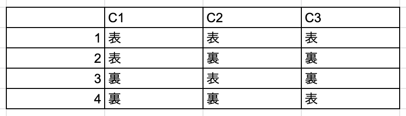

# 07.組み合わせによる効率的なテスト：ペア構成テスト

これまでいくつかテスト技法、有用なツールを見てきました。
以下にテスト技法とその時想定する変数の数の個人的な感覚を整理します。

|テスト技法|変数（x）|
|-|-|
|同値クラステスト|1|
|境界値テスト|1|
|ドメイン分析テスト|x<5|
|デシジョンテーブル|x<5|

より多くの変数の組み合わせのテストを行う場合、テストケースは膨大になっていきます。
全てを網羅するのは現実的ではなく、方針の切替が必要です。
-> 少ないテストケースである程度の網羅性を確保する方針
-> 重要な組み合わせやバグがありそうな組み合わせを重点的にテスト

## ペア構成テストとは？
ペア構成テストとは、変数の全ての入力の組み合わせをテストするのではなく、変数の全てのペアをテストするテスト技法です。

全てのペアについて以下に例をあげます。
```
3枚のコイン(C1、C2、C3)で表裏（2値条件）について考える場合
- 全ての組み合わせ　2 * 2 * 2 = 8通り
- 全てのペア (C1, C2)、(C2, C3)、(C1, C3)それぞれにコインの表裏のパターン（4通り）が入る
```

上記のように全てのペアをテストすることである程度の網羅性が確保できるだろうと言えるのには理由があります。多くの欠陥は次の二つに大別できます。
1. モジュール単体が正常動作しない
2. 2つのモジュールを組み合わせた時正常動作しない

上のように大別すると、ペアにしてテストした際には2番目について検出でき、検出した欠陥を精査することでモジュール単体の異常動作についても発見できるというわけです。

詳しくはこちらの記事([ペアワイズ法は本当に有効なのか？組み合わせテスト技法と上手に付き合う方法](https://dev.classmethod.jp/articles/introduction-to-combination-testing-methods/))が参考になります。

## 直行表
直行表とは、全てのペアを抜け漏れなく網羅するためのツールです。

コインを例にすると直行表は以下のようになります。
行がテストケースで、列に条件が入ります。


直行表をAとB、AとC、BとCに限定してみた時、状態の組み合わせが揃っていることがわかります。

直行表を見てパッと作るのは難しそうですが、そもそも作る必要はありません。
テスト実行者は既存の直行表から適切なものを選べれば大丈夫です。

直行表の表記法がわかれば選ぶのも難しくないと思います。
コインの例で出した直行表は4行で2値条件が3つなので「L4(2^3)」と表現されます。

8行で2値条件が1つならばL8(2^1)
5行で3値条件が4つならばL5(3^4)
9行で2値条件が4つ　3値条件が2つならばL9(2^4 3^2)

また調べる際には「[タグチ計画のカタログ](https://support.minitab.com/ja-jp/minitab/18/help-and-how-to/modeling-statistics/doe/supporting-topics/taguchi-designs/catalogue-of-taguchi-designs/)」が参考になると思います。

### 直行表の作り方
直行表の作り方を整理すると次のようになります。

1. 条件を全て把握する
2. 各条件の取り得る値を出す
3. 1と2の条件に合う直交表を選ぶ（完全一致がない場合少し大きめを選ぶ）
4. 直交表にテスト対象の条件をいれる


しかし、今回は[PICT](https://github.com/microsoft/pict)というツールを使って直行表を作成してみます。~~直行表を探すのが面倒~~

例として開発で使用するパソコンの設定でOS、言語、エディタの3条件についてのテストケースを考えてみます。

```
OS: Windows, macOS, Linux
言語: Python, Scala, Typescript
エディタ: Emacs, Atom, Vim
```

PICTで作成して直行表が次の表です。

|OS|言語|エディタ|
|-|-|-|
|Windows|Python|Emacs|
|Windows|Scala|Atom|
|Windows|Typescript|Vim|
|macOS|Python|Vim|
|macOS|Scala|Emacs|
|macOS|Typescript|Atom| 
|Linux|Python|Atom|
|Linux|Scala|Vim|
|Linux|Typescript|Emacs|