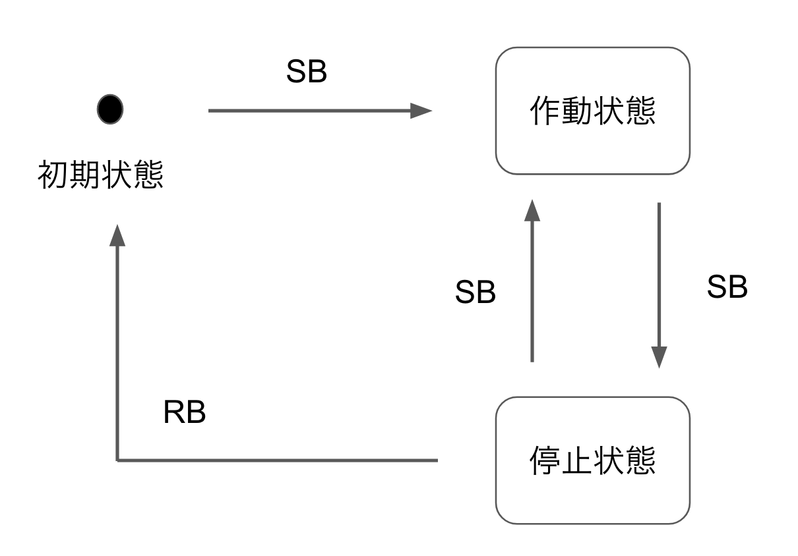
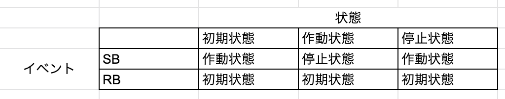

# 09.状態変化に対応するテスト:状態遷移テスト

これまでは条件とその取る値によって振る舞いが変わるシステムに関するテストを見てきました。
より発展的なものとして、現在の状態とその遷移（状態Aから状態Bに変化すること）によって振る舞いが変わるシステムに関するテストについて見ていきます。

状態遷移テストは二つのツールを使って次の流れで進めていきます。
1. 状態遷移図を描いて、全体を俯瞰する
2. 状態遷移表を作成して、詳細を確認する

今回はストップウォッチを例にして考えます。

ストップウォッチは次のような振る舞い（仕様）をします。
ここでスタート/ストップボタンをSB、ストップウォッチ機能をSW、リセットボタンをRBと表します。
```
- 初期状態でSWは作動していない
- 初期状態でSBを押すと、SWが作動する（時間計測が始まる）
- 作動状態でSBを押すと、SWが停止する（時間計測が停止され、その時点での秒数が表示される）
- 停止状態でSBを押すと、再びSWが作動する（時間計測が再開される）
- 停止状態でRBを押すと、初期状態になる
```

## 状態遷移図
ストップウォッチの仕様について改めて確認します。

```
ストップウォッチの仕様
スタート/ストップボタン->SB、ストップウォッチ機能->SW、リセットボタン->RB

- 初期状態でSWは作動していない
- 初期状態でSBを押すと、SWが作動する（時間計測が始まる）
- 作動状態でSBを押すと、SWが停止する（時間計測が停止され、その時点での秒数が表示される）
- 停止状態でSBを押すと、再びSWが作動する（時間計測が再開される）
- 停止状態でRBを押すと、初期状態になる
```

これを元に状態遷移図を描くと次のような図になります。


状態として初期状態、作動状態、停止状態があります。また状態遷移のトリガーイベントとしてSBとRBがあり、矢印によって状態遷移の数とトリガーイベントの始状態と終状態を示しています。

状態遷移図は上手のように大雑把に状態間の関係性を描画するものです。
これを元に状態遷移を表にしてテストケースを洗い出すことになります。
テストに指針としてまずは「全ての遷移をテストすること」です。

状態遷移図では矢印の数が状態遷移の数です。
そこで最低限テストするケースは次の4つです。

- 初期状態 + SB -> 作動状態に遷移 
- 作動状態 + SB -> 停止状態に遷移
- 停止状態 + SB -> 作動状態に遷移
- 停止状態 + RB -> 初期状態に遷移

また、状態遷移図にはないが実際に操作可能な物もあります。
例えば
- 初期状態 + RB -> ?
- 作動状態 + RB -> ?

これらについては現実的に起こりうるかどうかを加味してテストケースに含めるかどうかは判断することになると思います。今回の例では誤操作として十分ありうるのでテストするべきです。
このような例は適用不可能な遷移として、NA(Not Applicable)と呼びます。

## 状態遷移表
状態遷移図は状態遷移を俯瞰し、全体像を把握するのに有効ですがNAのようなケースも漏れなく見出すのは難しいです。

そこで状態遷移表を使います。
今回の例では状態遷移表は次のようになります。


状態遷移表は列の一番上が始状態を表し、イベントと直行する成分がそのイベントによる終状態を表します。NAはイベントに対応する終状態が存在しないことを示します。

状態遷移表によって仕様の抜け漏れもチェックできるのが利点です。
しかし、テストはこれで十分というわけではありません。
なぜなら、2状態の遷移については状態遷移表で網羅できていますが、3状態については記載がされていないためです。3状態の遷移とは「停止状態-> 初期状態 -> 作動状態」のような遷移です。

状態遷移に伴ってシステムの内部状態が変化してしまう場合も考慮して、状態遷移の組み合わせに関するテストも必要になります。このような場合には**Nスイッチカバレッジテスト**が有用です。

## Nスイッチカバレッジ
Nスイッチカバレッジテストは、N+1回状態遷移を網羅するパスのテストです。

今回のストップウォッチの例では、NAとなる部分は初期状態に戻るような仕様を考えることとします。


作成した状態遷移表をNスイッチカバレッジのテストのために関係行列（状態の関係性を行列で表現したもの）に書き直します。この行列は始状態を行、終状態を列、トリガーイベントを成分に持ちます。


関係行列を二乗すると、


上の表の成分の表示と意味は次のように対応します。

- RS: リセットボタンを押した後、スタート/ストップボタンを押す
- RS + SR: リセットボタンを押してスタート/ストップボタンを押すか、スタート/ストップボタンを押してリセットボタンを押す

上表は1スイッチカバレッジの表です。1スイッチとは始状態から終状態までに経由する中間状態の数を指します。スイッチの数Nに対して、N+1乗するとNスイッチカバレッジの表が得られます。
今回の表では12のテストケースになります。

注意点として、Nの数が大きくなるほどテストケースが増大します。まずは状態遷移表を使ったすべての遷移の確認を行い、 その上で必要に応じてNスイッチカバレッジをNが小さい順に段階的に必要なテストを行っていくのが望ましいです。